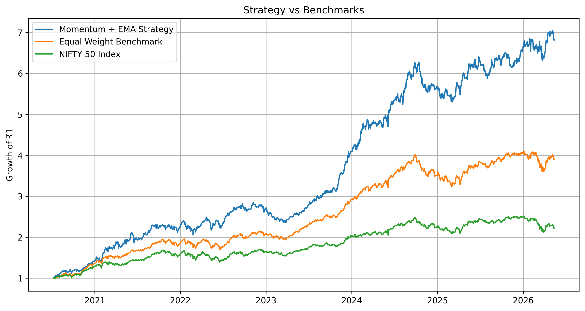
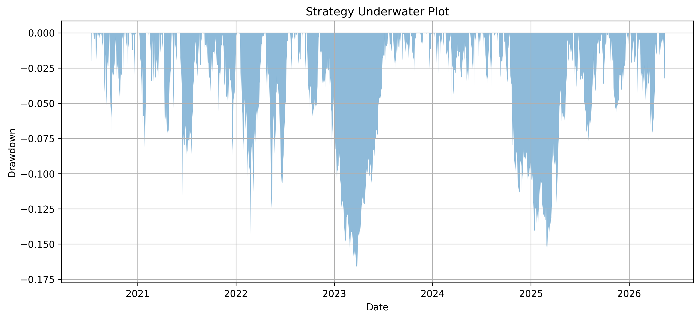
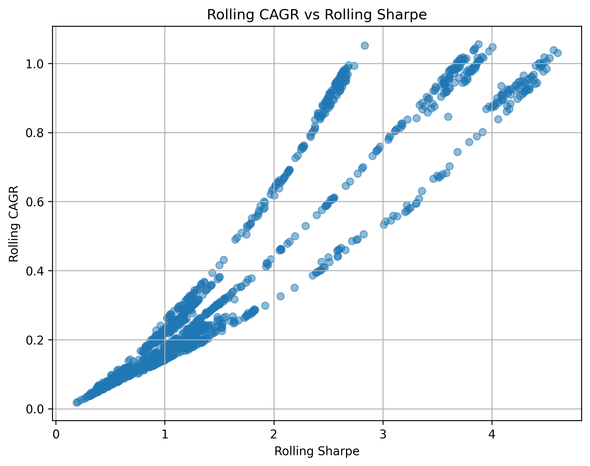

# Momentum-Driven Sector Rotation in Indian Equities

## Overview

This project investigates a systematic momentum and trend-following strategy applied to the NIFTY 50 universe.

The strategy ranks stocks based on their 63-day momentum, applies trend filters using the 50-day Exponential Moving Average (EMA), and constructs an equal-weight portfolio of the top 5 eligible stocks. The portfolio is rebalanced every 63 trading days (approximately quarterly).

The objective is to determine whether a simple rules-based process can generate excess returns relative to both an equal-weight benchmark and the NIFTY 50 index.

---

## Strategy Rules

### Universe

- NIFTY 50 Stocks

### Momentum Signal

- 63-day price momentum

### Trend Filters

A stock is eligible only if:

- Price > EMA50
- EMA50 Slope > 0

### Portfolio Construction

- Rank eligible stocks by momentum
- Select Top 5 stocks
- Equal weight allocation (20% each)

### Rebalancing

- Every 63 trading days (~Quarterly)

### Transaction Costs

- 0.05% per rebalance

---

## Performance Summary

| Metric                 | Value , |
|------------------------|--------:|
| Strategy Return        | 673.23% |
| Equal Weight Benchmark | 283.16% |
| NIFTY 50 Return        | 122.35% |
| CAGR                   | 41.92%  |
| Sharpe Ratio           | 1.87    |
| Max Drawdown           | -16.16% |
| Annual Turnover        | 345.45% |
| Average Survivors      | 0.68/5  |

---

## Equity Curve



---

## Drawdown Analysis



## Rolling CAGR vs Sharpe



---

## Key Findings

### Alpha Attribution

The majority of returns were generated by a small number of strong trend leaders:

- ADANIENT
- TRENT
- ETERNAL
- JSWSTEEL
- SHRIRAMFIN
- M&M

This behavior is consistent with momentum investing, where a small number of large winners contribute a significant portion of total portfolio returns.

---

### Sector Attribution

Top contributing sectors:

| Sector      | Contribution |
|----------   |----------:|
| Retail      | 2.86 |
| Industrials | 2.51 |
| Metals      | 1.31 |
| Auto        | 1.11 |
| Energy      | 0.90 |

Weakest sectors:

- Pharma
- Materials
- Telecom

---

### Portfolio Evolution

The strategy dynamically rotated across market leadership themes:

#### 2020

- Auto
- Energy
- Metals

#### 2021

- Industrials
- Metals
- Infrastructure

#### 2022

- Energy
- PSU
- Defence

#### 2023

- Retail
- Financials
- Auto

#### 2024

- Retail
- Defence
- Industrials

This suggests the strategy acts as an implicit sector-rotation model rather than maintaining fixed sector exposure.

---

## Market Regime Analysis

The strategy performed differently across market environments.

| Year | Market Environment                                | Strategy Behavior |
|------|-------------------                                |-------------------|
| 2020 | Post-COVID recovery, liquidity-driven rally       | Captured recovery leaders in Auto, Metals, and Energy |
| 2021 | Strong bull market, commodity and industrial boom | Significant alpha from Industrials and Metals |
| 2022 | Inflation shock, rate hikes, Ukraine war          | Rotated into Energy, Defence, and PSU leaders |
| 2023 | Capex and manufacturing expansion cycle           | Benefited from Industrials, -Retail, and Financials |
| 2024 | PSU, Defence, Capital Goods, and Retail leadership| Strongest alpha generation period |
| 2025 | More rotational and less trend-persistent market  | Momentum effectiveness weakened |
| 2026* | Partial year                                     | Early results indicate continued resilience |


### Key Observation

The strategy performs best during periods of strong sector leadership and persistent trends.

The strongest years (2021 and 2024) coincided with clear market leadership in sectors such as Industrials, Metals, Retail, Defence, and Energy.

Performance weakened during more rotational environments where leadership changed frequently and trends were less persistent.

## Visual Strategy Inspection

To better understand portfolio behavior beyond aggregate performance metrics, interactive Plotly dashboards were created for selected rebalance periods.

The dashboards visualize:

- Stock Price
- EMA50 Trend Filter
- EMA50 Slope
- Rebalance Date
- Momentum Score

Three representative portfolio selections were analyzed:

- Best Rebalance Period
- Worst Rebalance Period
- Median Rebalance Period

### Key Observations

#### Best Rebalance Period

The strongest portfolio periods typically exhibited:

- Strong positive momentum
- Price significantly above EMA50
- Rising EMA50
- Strong positive EMA slope
- Emerging market leaders and trend acceleration

Examples included:

- TRENT
- COALINDIA
- LT
- NTPC
- ETERNAL

#### Worst Rebalance Period

The weakest portfolio periods often occurred when:

- Momentum leadership was weak across the universe
- Stocks exhibited flattening trends
- EMA slope was deteriorating
- Few strong trend-following opportunities existed

This suggests strategy performance is highly dependent on the availability of strong momentum leaders.

### Research Insight

Visual analysis revealed that the strategy is not a bottom-fishing system.

Instead, it primarily identifies:

- Established uptrends
- Trend acceleration phases
- Emerging market leaders

after trend confirmation has already occurred.

## Robustness Checks

The following tests were performed:

- Look-ahead bias removal
- Transaction cost inclusion
- Top 3 / Top 5 / Top 7 portfolio comparison
- NIFTY 50 benchmark comparison
- NIFTY 100 universe comparison
- Turnover analysis
- Contribution analysis
- Sector attribution analysis
- Portfolio evolution analysis
- Best / Worst / Median rebalance inspection
- Interactive chart-based validation

Top 5 holdings produced the best balance between:

- Return
- Diversification
- Risk-adjusted performance

The strategy remained robust across multiple market environments while maintaining reasonable drawdown characteristics.
---

## Limitations

- Universe is limited to NIFTY 50 stocks.
- Results may be affected by survivorship bias.
- Strategy uses a fixed 63-day momentum lookback and EMA50 filter, which may not remain optimal in future market regimes.
- Portfolio is rebalanced quarterly, which may miss faster trend changes.
- Historical performance does not guarantee future returns.

---

## Project Structure

momentum_driven_sector_rotation/

├── momentum_driven_sector_rotation.ipynb
├── README.md

├── plots/
│   ├── equity_curve.png
│   ├── drawdown.png
│   ├── yearly_returns.png
│   ├── rolling_cagr_vs_sharpe.png
│   ├── best_rebalance_inspection.html
│   ├── median_rebalance_inspection.html
│   └── worst_rebalance_inspection.html

└── results/
    ├── summary_metrics.csv
    ├── yearly_performance.csv
    ├── top_contributors.csv
    ├── sector_contributions.csv
    ├── portfolio_history.csvv
```

---

---

# Updated Conclusion


## Conclusion

A systematic momentum and trend-following strategy was developed and tested on the NIFTY 50 universe.

The strategy combines:

- 63-day Momentum
- EMA50 Trend Confirmation
- Positive EMA50 Slope
- Quarterly Rebalancing
- Equal-Weight Portfolio Construction

Results demonstrated substantial outperformance relative to both the NIFTY 50 Index and an Equal-Weight Benchmark.

Key findings include:

- Momentum leadership is a major source of alpha.
- Strong trends tend to persist once confirmed.
- Sector leadership rotates dynamically over time.
- Trend confirmation improves risk-adjusted performance.
- The strongest portfolio periods coincide with broad momentum participation across the market.

Visual inspection further showed that the strategy primarily captures established trends and trend acceleration rather than attempting to predict market bottoms.

Overall, the results suggest that momentum combined with trend confirmation can serve as an effective, intuitive, and economically grounded source of alpha in Indian equities.