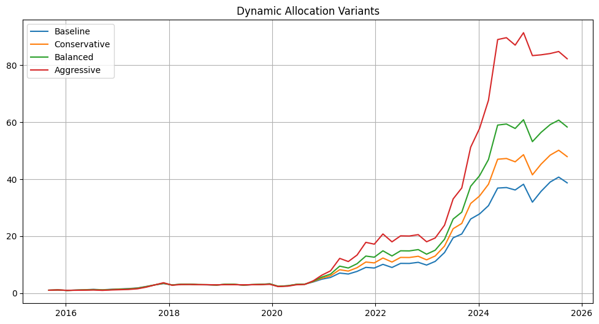
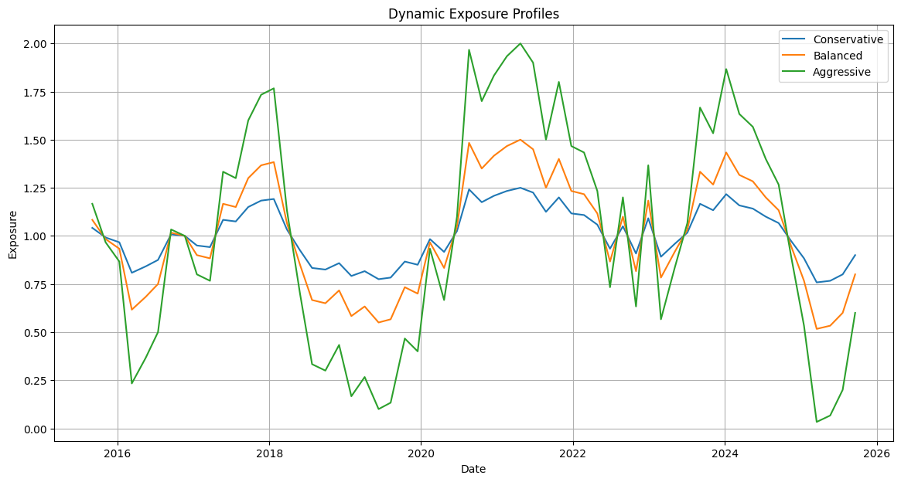
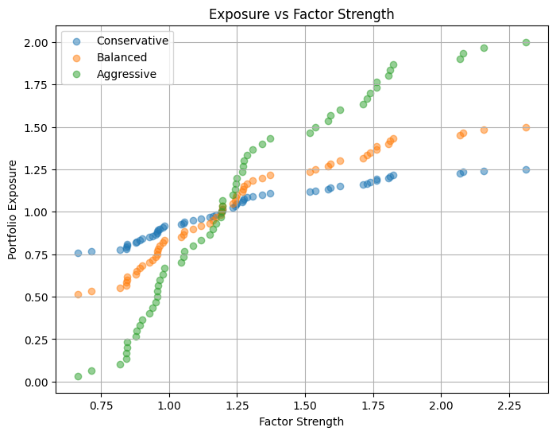

# NIFTY500 Factor Investing Research

A quantitative research project exploring factor investing, momentum strategies, factor timing, dynamic capital allocation, and portfolio construction in the Indian equity market.

---

## Project Overview

This project follows a complete quantitative research workflow:

```text
Data Collection
      ↓
Factor Discovery
      ↓
Information Coefficient (IC) Analysis
      ↓
Portfolio Construction
      ↓
Portfolio Optimization
      ↓
Transaction Cost Analysis
      ↓
Market Regime Analysis
      ↓
Volatility Regime Analysis
      ↓
Factor Timing
      ↓
Dynamic Capital Allocation
```

**Universe:** NIFTY 500

**Period:** 2015–2025

**Frequency:** Daily

---

# Primary Research Finding

The most important finding of this research was not the momentum factor itself.

A **Factor Strength** signal was developed:

```text
Factor Strength
=
Mean(Top 20 Momentum Scores)
-
Mean(Bottom 20 Momentum Scores)
```

This signal measures the strength of the momentum factor across the market and was used to dynamically adjust portfolio exposure.

The results suggest that capital allocation based on factor conditions can materially improve performance while maintaining reasonable portfolio risk.

---

# Strategy Evolution

## Baseline Momentum Strategy

### Portfolio Rules

- Factor: Momentum126
- Portfolio Size: Top 20 Stocks
- Equal Weight Allocation
- Rebalance Every 42 Trading Days
- Transaction Cost: 0.10%

### Performance

| Metric | Value |
|----------|----------:|
| CAGR | 40.39% |
| Sharpe Ratio | 1.38 |
| Max Drawdown | -28.45% |

---

# Dynamic Capital Allocation Models

Rather than maintaining constant portfolio exposure, portfolio weights were dynamically adjusted based on Factor Strength.

### Key Finding

Factor Strength successfully identified favorable and unfavorable momentum environments.

Expanding the allowable exposure range produced a consistent increase in CAGR:

| Strategy | Exposure Range | Total Return | CAGR | Sharpe | Max Drawdown | Win Rate | Profit Factor |
|----------|----------|----------:|----------:|----------:|----------:|----------:|----------:|
| Baseline | 1.00x | 37.71% | 43.09% | 1.38 | -28.45% | 72.13% | 4.02 |
| Conservative | 0.75x → 1.25x | 46.90% | 46.11% | 1.38 | -30.33% | 72.13% | 4.26 |
| Balanced | 0.50x → 1.50x | 57.29% | 48.95% | 1.36 | -32.35% | 72.13% | 4.52 |
| Growth | 0.25x → 1.75x | 68.79% | 51.60% | 1.33 | -34.50% | 72.13% | 4.78 |
| Aggressive | 0.00x → 2.00x | 81.24% | 54.06% | 1.29 | -36.76% | 72.13% | 5.04 |

### Interpretation

**Baseline**

- Constant 1.0x exposure
- Serves as benchmark for timing models

**Conservative**

- Highest Sharpe Ratio
- Small increase in drawdown
- Most practical implementation

**Balanced**

- Strong CAGR improvement
- Moderate drawdown increase
- Attractive risk-return tradeoff

**Growth**

- Significant increase in total return
- Moderate deterioration in risk-adjusted performance

**Aggressive**

- Highest CAGR and Total Return
- Highest Profit Factor
- Largest drawdown
- Best suited for investors prioritizing growth over risk control

The Sharpe ratio remained relatively stable while returns increased, suggesting that Factor Strength contains useful information about future momentum profitability and can be used as a dynamic capital allocation signal.


#### Conservative Allocation

- Highest risk-adjusted performance
- Minimal increase in drawdown
- Most practical implementation

#### Balanced Allocation

- Significant CAGR improvement
- Moderate drawdown increase
- Strong overall risk-return tradeoff

#### Aggressive Allocation

- Highest absolute return
- Highest growth potential
- Largest drawdowns
- Suitable only for investors with high risk tolerance

---

## Allocation Model Comparison



Wider exposure ranges improved returns but increased volatility and drawdown.

---

# Dynamic Exposure Profiles



Portfolio exposure varies through time according to Factor Strength.

Despite large changes in exposure limits, average exposure remained close to 1.0x throughout the sample period.

---

# Exposure vs Factor Strength



Exposure increases monotonically with Factor Strength, confirming that capital allocation responds systematically to market factor conditions.

---

# Baseline Momentum Strategy Performance


Performance of the Momentum126 strategy prior to dynamic allocation enhancements.

---

# Factor Discovery

A broad factor universe was constructed and evaluated using cross-sectional Information Coefficient (IC) analysis.

## Factors Evaluated

- Momentum63
- Momentum126
- Relative Strength
- Trend Strength
- Breakout
- Volatility
- Volume Trend

### Mean Information Coefficient (IC)

| Factor | Mean IC |
|----------|----------:|
| Momentum126 | 0.0427 |
| TrendStrength | 0.0358 |
| Momentum63 | 0.0258 |
| RelativeStrength | 0.0258 |
| Breakout | 0.0239 |
| Volatility | -0.0019 |
| VolumeTrend | -0.0049 |

### Key Finding

Momentum126 demonstrated the strongest and most consistent predictive power and was selected as the primary ranking factor.

---

# Portfolio Construction

## Portfolio Rules

- Rank stocks using Momentum126
- Select Top 20 Stocks
- Equal Weight Allocation
- Rebalance Every 42 Trading Days

### Portfolio Concentration Analysis

| Portfolio Size | Top-Bottom Spread |
|----------|----------:|
| Top 5 | 2.26% |
| Top 10 | 4.43% |
| Top 20 | 4.42% |
| Top 30 | 3.94% |
| Top 50 | 3.13% |

### Key Finding

A portfolio size of 20 stocks provided the best balance between alpha generation and diversification.

---

# Rebalancing Frequency Analysis

The following rebalancing schedules were tested:

- 21 Trading Days
- 42 Trading Days
- 63 Trading Days
- 126 Trading Days

| Frequency | CAGR | Sharpe |
|----------|----------:|----------:|
| 21 Days | 40.10% | 1.40 |
| 42 Days | 40.79% | 1.39 |
| 63 Days | 37.21% | 1.17 |
| 126 Days | 36.01% | 1.14 |

### Key Finding

A 42-day rebalancing frequency delivered the strongest overall performance while maintaining efficient turnover.

---

# Transaction Cost Analysis

Transaction costs tested:

- 0.05%
- 0.10%
- 0.25%
- 0.50%


### Key Finding

The strategy remained profitable and robust under realistic transaction cost assumptions.

---

# Market Regime Analysis

Momentum performance was evaluated across different market environments.

### Regimes Tested

- Bull Markets
- Bear Markets

### Key Finding

Momentum remained effective across both market regimes.

Restricting the strategy exclusively to bull markets reduced overall performance.

---

# Volatility Regime Analysis

Market conditions were classified into:

- Low Volatility
- Medium Volatility
- High Volatility

### Key Finding

Momentum returns were strongest during high-volatility periods.

However, explicitly filtering trades using volatility regimes reduced total strategy performance.

---

# Factor Timing Research

This notebook represents the primary contribution of the project.

## Research Question

Can factor strength predict future momentum performance?

### Findings

- Positive relationship between Factor Strength and future returns
- Stronger factor environments generated larger momentum profits
- Dynamic allocation improved long-term performance

### Conclusion

Factor Strength contains predictive information and can be used as a dynamic portfolio allocation signal.

---

# Market Stretch Analysis

Market Stretch was defined as:

```text
Market Stretch
=
Market Index / MA252 - 1
```

### Findings

| Metric | Value |
|----------|----------:|
| Correlation | -0.1587 |

Key observations:

- Oversold markets generated stronger subsequent returns
- Evidence of mean reversion was observed
- Timing signals based on market stretch did not improve momentum performance

---

# Combined Timing Framework

The final experiment combined:

- Factor Strength Timing
- Market Stretch Timing

### Result

The combined model underperformed the pure Factor Strength allocation framework.

As a result, the final strategy uses only the Factor Strength signal for dynamic capital allocation.

---

# Research Summary

### Core Findings

1. Momentum126 was the strongest factor within the tested factor universe.
2. A Top-20 portfolio produced the best diversification-return tradeoff.
3. A 42-day rebalance frequency delivered optimal performance.
4. The strategy remained robust under realistic transaction costs.
5. Momentum performed well across market and volatility regimes.
6. Factor Strength successfully predicted future momentum performance.
7. Dynamic capital allocation improved returns relative to static exposure.
8. Market Stretch exhibited mean reversion characteristics but did not improve allocation decisions.
9. Factor Strength was the most effective timing signal discovered during the research process.

---

## Disclaimer

This project is intended solely for educational and research purposes.

Nothing contained in this repository should be interpreted as financial, investment, or trading advice. Past performance does not guarantee future results.


