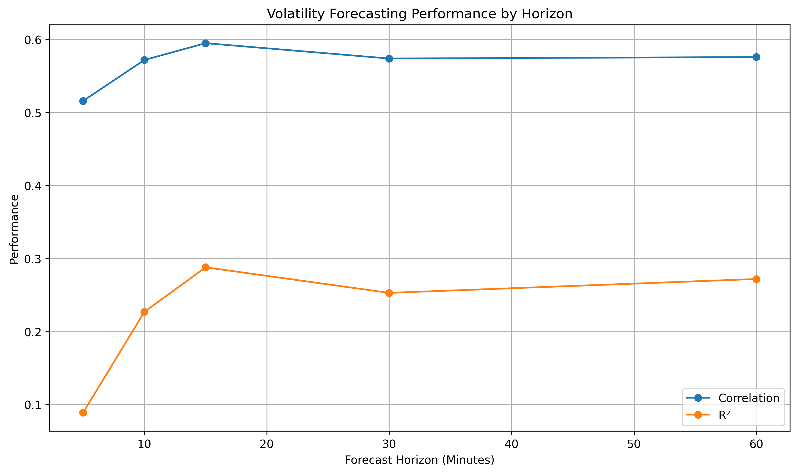
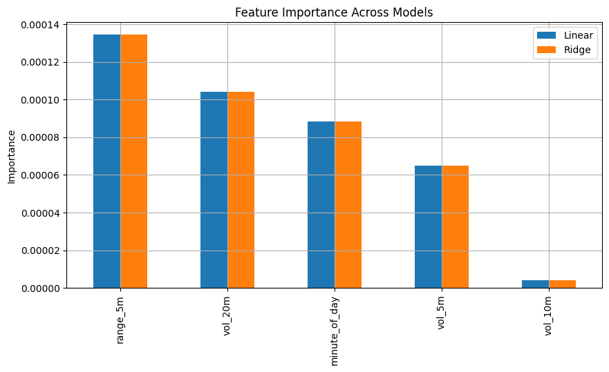
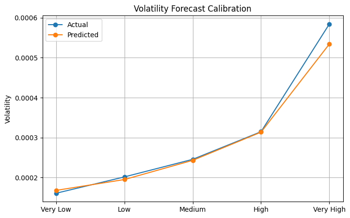

````markdown
# Intraday Volatility Forecasting in NIFTY 50

## Overview

This project investigates whether future intraday volatility can be predicted using information available at the current minute.

Unlike traditional intraday trading research that focuses on predicting returns, this study focuses on forecasting realized volatility using minute-level NIFTY 50 data from 2015 to 2025.

The research combines statistical analysis, machine learning, and robustness testing to understand the drivers of short-term volatility and evaluate whether future volatility contains meaningful predictive structure.

Dataset:

- NIFTY 50 Minute Data
- Period: 2015 – 2025
- Frequency: 1 Minute

---

# Executive Summary

## Research Question

Can current market conditions predict realized volatility over the next 15 minutes?

## Answer

Yes.

A Random Forest model achieved:

| Metric | Value |
|----------|----------:|
| R² | 0.288 |
| Correlation | 0.596 |
| MAE | 0.000106 |

Future volatility exhibits meaningful predictability through:

- Intraday Seasonality
- Volatility Clustering
- Recent Price Range Expansion

---

# Forecasting Workflow

```text
Minute-Level NIFTY Data
            │
            ▼
Feature Engineering
            │
            ├── range_5m
            ├── vol_5m
            ├── vol_10m
            ├── vol_20m
            └── minute_of_day
            │
            ▼
Random Forest Forecasting Model
            │
            ▼
Future 15-Minute Volatility Prediction
            │
            ▼
Model Evaluation
            │
            ├── R²
            ├── Correlation
            ├── MAE
            └── Regime Stability
            │
            ▼
Robustness Checks
            │
            ├── Linear Regression
            └── Ridge Regression
            │
            ▼
Final Insights
````

---

# Key Visualizations

## Forecast Horizon Study



The 15-minute horizon produced the strongest forecasting performance, suggesting that volatility persistence is most predictable over short-to-medium intraday horizons.

---

## Feature Importance


Intraday seasonality, volatility persistence, and recent price range expansion emerged as the dominant drivers of future volatility.

---

## Model Comparison



Feature rankings remain stable across Random Forest, Linear Regression, and Ridge Regression models, indicating robust findings.

---

## Forecast Calibration



Higher predicted volatility corresponds to higher realized volatility, indicating that the model correctly ranks future volatility environments.

---

# Methodology

## Target Variable

Future 15-Minute Realized Volatility

Calculated as:

Future Volatility = Rolling Standard Deviation of Returns over the Next 15 Minutes

## Features

### Volatility Features

* 5-Minute Volatility
* 10-Minute Volatility
* 20-Minute Volatility

### Range Features

* 5-Minute Price Range

### Time Features

* Minute of Day

### Return Features

* 5-Minute Return
* 10-Minute Return

---

# Feature Correlation Analysis

Correlation with Future 15-Minute Volatility:

| Feature          | Correlation |
| ---------------- | ----------: |
| Range (5m)       |       0.345 |
| Volatility (20m) |       0.343 |
| Volatility (10m) |       0.315 |
| Volatility (5m)  |       0.283 |
| Return (10m)     |      -0.025 |
| Return (5m)      |      -0.022 |
| Volatility Ratio |      -0.017 |

## Key Finding

Returns contain almost no predictive information.

Volatility measures and recent trading range are the strongest predictors of future volatility.

---

# Volatility Clustering Study

Current volatility was divided into quintiles.

| Volatility Bucket | Future 15m Volatility |
| ----------------- | --------------------: |
| Very Low          |              0.000205 |
| Low               |              0.000261 |
| Medium            |              0.000308 |
| High              |              0.000370 |
| Very High         |              0.000559 |

## Key Finding

Future volatility rises monotonically with current volatility.

The highest volatility regime experiences approximately 2.73× the future volatility of the lowest volatility regime.

### Interpretation

Volatility is persistent.

Periods of high volatility tend to be followed by high volatility, while periods of low volatility tend to remain calm.

---

# Time-of-Day Analysis

| Period    | Future Volatility |
| --------- | ----------------: |
| Open      |          0.000362 |
| Morning   |          0.000264 |
| Midday    |          0.000260 |
| Afternoon |          0.000305 |
| Close     |          0.000511 |

## Key Finding

Volatility follows a U-shaped intraday profile:

```text
High → Low → High
```

### Interpretation

Volatility is highest near market open and market close, confirming strong intraday seasonality.

---

# Forecast Horizon Study

| Horizon    |    R² | Correlation |
| ---------- | ----: | ----------: |
| 5 Minutes  | 0.089 |       0.516 |
| 10 Minutes | 0.227 |       0.572 |
| 15 Minutes | 0.288 |       0.595 |
| 30 Minutes | 0.253 |       0.574 |
| 60 Minutes | 0.272 |       0.576 |

## Key Finding

The 15-minute horizon produced the strongest forecasting performance.

---

# Market Regime Analysis

| Period    |    R² | Correlation |
| --------- | ----: | ----------: |
| 2015–2019 | 0.283 |       0.603 |
| 2020–2022 | 0.483 |       0.710 |
| 2023–2025 | 0.339 |       0.588 |

## Key Finding

Forecasting remained effective across all market environments.

### Interpretation

The forecasting signal survives:

* Normal Markets
* COVID Volatility
* Post-COVID Markets

The strongest performance occurred during the highly volatile 2020–2022 period.

---

# Feature Importance Analysis

## Random Forest Ranking

| Rank | Feature          | Importance |
| ---- | ---------------- | ---------: |
| 1    | Minute of Day    |      0.399 |
| 2    | Volatility (20m) |      0.283 |
| 3    | Range (5m)       |      0.202 |
| 4    | Volatility (10m) |      0.079 |
| 5    | Volatility (5m)  |      0.036 |

## Interpretation

The model primarily relies on:

1. Intraday Seasonality
2. Volatility Persistence
3. Recent Range Expansion

---

# Robustness Check

To verify that the Random Forest findings were not model-specific, feature importance was also evaluated using:

* Linear Regression
* Ridge Regression

## Feature Importance Comparison

| Feature          | Random Forest Rank | Linear Rank | Ridge Rank | Verdict          |
| ---------------- | ------------------ | ----------- | ---------- | ---------------- |
| Range (5m)       | 3                  | 1           | 1          | Strong Predictor |
| Volatility (20m) | 2                  | 2           | 2          | Strong Predictor |
| Minute of Day    | 1                  | 3           | 3          | Strong Predictor |
| Volatility (5m)  | 5                  | 4           | 4          | Weak Predictor   |
| Volatility (10m) | 4                  | 5           | 5          | Weak Predictor   |

## Interpretation

Although rankings differ slightly, all models consistently identify:

* Range (5m)
* Volatility (20m)
* Minute of Day

as the dominant drivers of future volatility.

---

# Volatility Regime Analysis

The model was further evaluated across different volatility environments.

Key objectives:

* Measure forecast quality in low-, medium-, and high-volatility regimes.
* Evaluate forecast calibration.
* Detect systematic forecast bias.
* Verify that higher predicted volatility corresponds to higher realized volatility.

Results indicate that model performance remains stable across different volatility environments and that the model correctly ranks future volatility conditions.

---

# Research Findings Summary

| Question                            | Result                           |
| ----------------------------------- | -------------------------------- |
| Can future volatility be predicted? | Yes                              |
| Forecast Quality                    | R² = 0.288                       |
| Forecast Accuracy                   | Correlation = 0.596              |
| Stable Across Market Regimes?       | Yes                              |
| Stable Across Models?               | Yes                              |
| Best Horizon                        | 15 Minutes                       |
| Strongest Predictors                | range_5m, vol_20m, minute_of_day |

---

# Final Conclusions

| Finding                                           | Evidence                   |
| ------------------------------------------------- | -------------------------- |
| Future intraday volatility is predictable         | R² ≈ 0.29                  |
| Volatility clustering exists                      | Volatility Bucket Analysis |
| Intraday seasonality exists                       | Time-of-Day Analysis       |
| 15-minute horizon is optimal                      | Horizon Study              |
| Range expansion predicts future volatility        | Feature Importance         |
| Volatility persistence predicts future volatility | Feature Importance         |
| Results remain stable across market regimes       | Market Regime Analysis     |
| Results remain stable across model families       | RF, Linear, Ridge          |

---

# Final Takeaway

The primary drivers of future intraday volatility are:

1. Recent Price Range Expansion (`range_5m`)
2. Volatility Persistence (`vol_20m`)
3. Intraday Seasonality (`minute_of_day`)

These findings remain consistent across:

* Multiple Market Regimes
* Multiple Model Families
* Different Forecast Horizons

The results suggest that short-term volatility forecasting in NIFTY 50 contains genuine and persistent predictive structure, making volatility substantially more predictable than short-term returns.

---

# Project Structure

```text
intraday_volatility_forecasting/
├── 01_INTRADAY_VOLATILITY_FORECASTING.ipynb
├── 02_LINEAR_MODEL_ANALYSIS.ipynb
├── 03_VOLATILITY_REGIME_ANALYSIS.ipynb
├── README.md
├── plots/
│   ├── horizon_study.png
│   ├── rf_feature_importance.png
│   ├── model_comparison.png
│   └── forecast_calibration.png
└── results/
    ├── model_comparison.csv
    ├── linear_feature_importance.csv
    ├── ridge_feature_importance.csv
    └── forecast_calibration.csv
```

```
```
